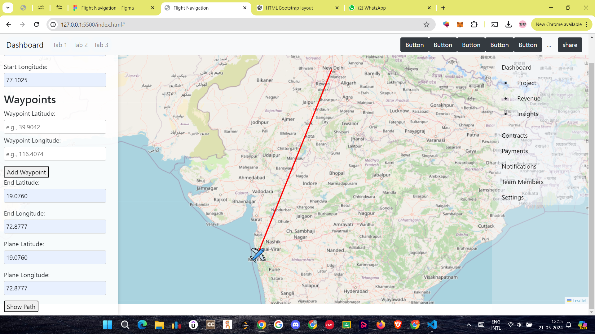

# Aerothon Final Hackathon 
# PlaneTracking
By giving latitude and longitude points of path along with current and start, end points we can display path of plane.

# This is just some part and my contribution towards project in my team.

